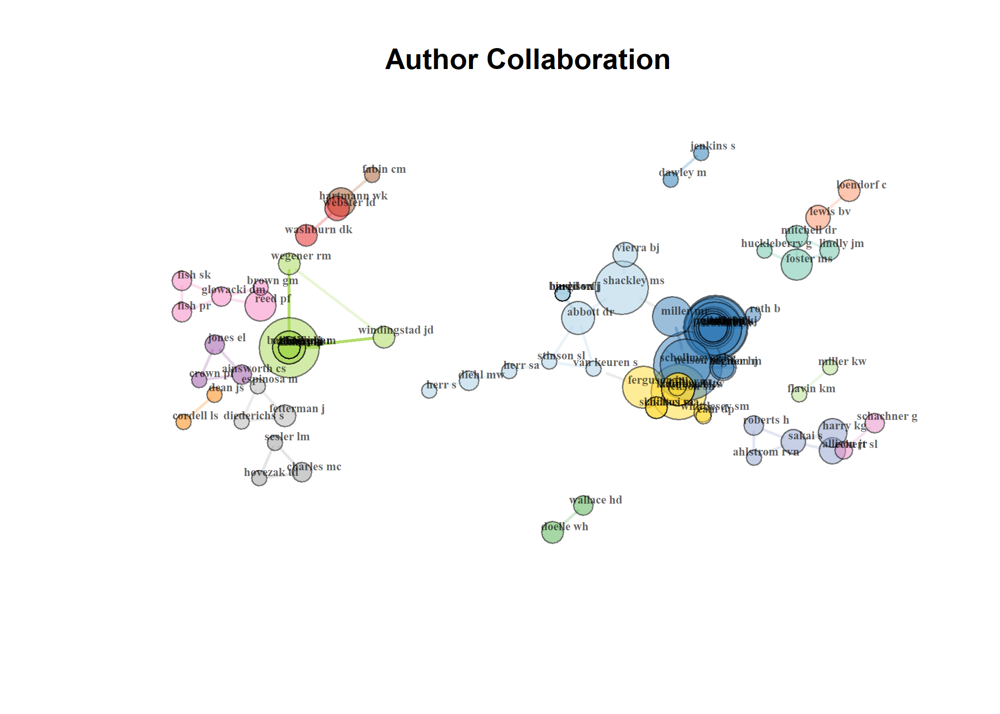

Bibliometric analysis of publications in Kiva from 2001 - 2020
================
Robert Z. Selden, Jr.
20 May, 2021

## Bibliometrics

The dataset used in this analysis was harvested from
[Scopus](https://www.elsevier.com/solutions/scopus), includes all
articles published in *Kiva* from 2001 - 2020, and was analysed using
the `bibliometrix` package (Aria and Cuccurullo 2017).

``` r
# install bibliometrix and load data
# devtools::install_github("massimoaria/bibliometrix")

# load
library(here)
```

    ## here() starts at D:/github/kivabib

``` r
library(bibliometrix)
```

    ## To cite bibliometrix in publications, please use:
    ## 
    ## Aria, M. & Cuccurullo, C. (2017) bibliometrix: An R-tool for comprehensive science mapping analysis, 
    ##                                  Journal of Informetrics, 11(4), pp 959-975, Elsevier.
    ##                         
    ## 
    ## https://www.bibliometrix.org
    ## 
    ##                         
    ## For information and bug reports:
    ##                         - Send an email to info@bibliometrix.org   
    ##                         - Write a post on https://github.com/massimoaria/bibliometrix/issues
    ##                         
    ## Help us to keep Bibliometrix free to download and use by contributing with a small donation to support our research team (https://bibliometrix.org/donate.html)
    ## 
    ##                         
    ## To start with the shiny web-interface, please digit:
    ## biblioshiny()

``` r
library(reshape2)
library(ggplot2)

# data frame
df <- convert2df(file = "scopus.bib", 
                 dbsource = "scopus", 
                 format = "bibtex")
```

    ## 
    ## Converting your scopus collection into a bibliographic dataframe
    ## 
    ## 
    ## Warning:
    ## In your file, some mandatory metadata are missing. Bibliometrix functions may not work properly!
    ## 
    ## Please, take a look at the vignettes:
    ## - 'Data Importing and Converting' (https://www.bibliometrix.org/vignettes/Data-Importing-and-Converting.html)
    ## - 'A brief introduction to bibliometrix' (https://www.bibliometrix.org/vignettes/Introduction_to_bibliometrix.html)
    ## 
    ## 
    ## Missing fields:  ID 
    ## Done!
    ## 
    ## 
    ## Generating affiliation field tag AU_UN from C1:  Done!

## Descriptive analysis

``` r
results <- biblioAnalysis(df, 
                          sep = ";")
options(width = 100)
s <- summary(object = results, 
             k = 20, 
             pause = FALSE)
```

    ## 
    ## 
    ## MAIN INFORMATION ABOUT DATA
    ## 
    ##  Timespan                              2001 : 2020 
    ##  Sources (Journals, Books, etc)        1 
    ##  Documents                             389 
    ##  Average years from publication        9.89 
    ##  Average citations per documents       4.087 
    ##  Average citations per year per doc    0.3347 
    ##  References                            20101 
    ##  
    ## DOCUMENT TYPES                     
    ##  article        371 
    ##  editorial      14 
    ##  letter         1 
    ##  note           1 
    ##  review         2 
    ##  
    ## DOCUMENT CONTENTS
    ##  Keywords Plus (ID)                    0 
    ##  Author's Keywords (DE)                649 
    ##  
    ## AUTHORS
    ##  Authors                               487 
    ##  Author Appearances                    682 
    ##  Authors of single-authored documents  183 
    ##  Authors of multi-authored documents   304 
    ##  
    ## AUTHORS COLLABORATION
    ##  Single-authored documents             229 
    ##  Documents per Author                  0.799 
    ##  Authors per Document                  1.25 
    ##  Co-Authors per Documents              1.75 
    ##  Collaboration Index                   1.9 
    ##  
    ## 
    ## Annual Scientific Production
    ## 
    ##  Year    Articles
    ##     2001       16
    ##     2002       14
    ##     2003       16
    ##     2004       15
    ##     2005       19
    ##     2006       22
    ##     2007       18
    ##     2008       20
    ##     2009       26
    ##     2010       20
    ##     2011       20
    ##     2012       16
    ##     2013       19
    ##     2014       12
    ##     2015       24
    ##     2016       17
    ##     2017       24
    ##     2018       21
    ##     2019       21
    ##     2020       29
    ## 
    ## Annual Percentage Growth Rate 3.179538 
    ## 
    ## 
    ## Most Productive Authors
    ## 
    ##    Authors        Articles Authors        Articles Fractionalized
    ## 1    LEKSON SH           6  SEYMOUR DJ                       5.00
    ## 2    SHACKLEY MS         6  STONE T                          5.00
    ## 3    ADAMS KR            5  LEKSON SH                        3.64
    ## 4    CREEL D             5  LYONS PD                         3.50
    ## 5    REED PF             5  REED PF                          3.33
    ## 6    ROTH BJ             5  BELLORADO BA                     3.00
    ## 7    SEYMOUR DJ          5  COFFEY G                         3.00
    ## 8    STONE T             5  NA NA                            3.00
    ## 9    ALLISON JR          4  OSTERHOLTZ AJ                    3.00
    ## 10   ANYON R             4  SNEAD JE                         3.00
    ## 11   BELLORADO BA        4  WASHBURN DK                      3.00
    ## 12   FERGUSON JR         4  WEBSTER LD                       2.83
    ## 13   HARRY KG            4  ALLISON JR                       2.67
    ## 14   HARTMANN WK         4  SHACKLEY MS                      2.58
    ## 15   LYONS PD            4  ADAMS EC                         2.50
    ## 16   NELSON MC           4  DEAN RM                          2.50
    ## 17   WASHBURN DK         4  GEIB PR                          2.50
    ## 18   WEBSTER LD          4  VAN DYKE RM                      2.50
    ## 19   ABBOTT DR           3  WHITTLESEY SM                    2.33
    ## 20   ADAMS EC            3  JANETSKI JC                      2.20
    ## 
    ## 
    ## Top manuscripts per citations
    ## 
    ##                Paper                                     DOI TC TCperYear   NTC
    ## 1  CORDELL LS, 2007, KIVA     10.1179/kiv.2007.72.4.001      52     3.467  3.93
    ## 2  BENSON LV, 2009, KIVA      10.1179/kiv.2009.75.1.005      46     3.538 10.14
    ## 3  MALVILLE JM, 2001, KIVA    10.1080/00231940.2001.11758436 30     1.429  3.33
    ## 4  SANCHEZ MG, 2001, KIVA     10.1080/00231940.2001.11758451 28     1.333  3.11
    ## 5  GAINES EP, 2009, KIVA      10.1179/kiv.2009.74.3.003      25     1.923  5.51
    ## 6  LIEBMANN M, 2007, KIVA     10.1179/kiv.2007.73.2.006      25     1.667  1.89
    ## 7  POTTER JM, 2007, KIVA      10.1179/kiv.2007.72.4.002      25     1.667  1.89
    ## 8  LEKSON SH, 2002, KIVA      10.1080/00231940.2002.11758469 24     1.200  3.78
    ## 9  LAKATOS SA, 2007, KIVA     10.1179/kiv.2007.73.1.002      22     1.467  1.66
    ## 10 CHARLES MC, 2006, KIVA-a-b 10.1179/kiv.2006.72.2.003      22     1.375  2.88
    ## 11 KULISHECK J, 2003, KIVA    10.1080/00231940.2003.11758484 21     1.105  2.20
    ## 12 SCHILLACI MA, 2003, KIVA   10.1080/00231940.2003.11758476 21     1.105  2.20
    ## 13 MATSON RG, 2006, KIVA      10.1179/kiv.2006.72.2.002      20     1.250  2.62
    ## 14 BECK ME, 2006, KIVA        10.1179/kiv.2006.72.1.004      20     1.250  2.62
    ## 15 VANPOOL TL, 2006, KIVA     10.1179/kiv.2006.71.4.004      20     1.250  2.62
    ## 16 KANTNER J, 2003, KIVA-a    10.1080/00231940.2003.11758491 20     1.053  2.09
    ## 17 ROTH BJ, 2008, KIVA        10.1179/kiv.2008.73.3.004      19     1.357  6.91
    ## 18 VIERRA BJ, 2007, KIVA-a    10.1179/kiv.2007.73.2.002      19     1.267  1.44
    ## 19 CROWN PL, 2016, KIVA       10.1080/00231940.2016.1223981  18     3.000  6.24
    ## 20 DURAND KR, 2003, KIVA      10.1080/00231940.2003.11758489 17     0.895  1.78
    ## 
    ## 
    ## Corresponding Author's Countries
    ## 
    ##          Country Articles    Freq SCP MCP MCP_Ratio
    ## 1 USA                 217 0.93133 213   4    0.0184
    ## 2 MEXICO                8 0.03433   8   0    0.0000
    ## 3 CANADA                3 0.01288   0   3    1.0000
    ## 4 UNITED KINGDOM        2 0.00858   1   1    0.5000
    ## 5 NETHERLANDS           1 0.00429   0   1    1.0000
    ## 6 POLAND                1 0.00429   1   0    0.0000
    ## 7 SOUTH AFRICA          1 0.00429   0   1    1.0000
    ## 
    ## 
    ## SCP: Single Country Publications
    ## 
    ## MCP: Multiple Country Publications
    ## 
    ## 
    ## Total Citations per Country
    ## 
    ##     Country      Total Citations Average Article Citations
    ## 1 USA                        955                      4.40
    ## 2 MEXICO                      24                      3.00
    ## 3 CANADA                      14                      4.67
    ## 4 UNITED KINGDOM               6                      3.00
    ## 5 NETHERLANDS                  1                      1.00
    ## 6 POLAND                       1                      1.00
    ## 7 SOUTH AFRICA                 1                      1.00
    ## 
    ## 
    ## Most Relevant Sources
    ## 
    ##   Sources        Articles
    ## 1           KIVA      389

``` r
# plot attributes
plot(x = results, 
     k = 20, 
     pause = FALSE)
```


### Attributes of the local network

``` r
# calculate citations in local network
CR <- localCitations(df, sep = ";")

# top 20 cited authors in local network
CR$Authors[1:20,]
```

    ##               Author LocalCitations
    ## 77           CREEL D             11
    ## 225 KAMP-WHITTAKER A              7
    ## 289        MILLER MR              7
    ## 398        SHAFER HJ              7
    ## 352          REED PF              6
    ## 367          ROTH BJ              6
    ## 397      SHACKLEY MS              6
    ## 14           ANYON R              5
    ## 172         HARRY KG              5
    ## 215      JANETSKI JC              5
    ## 334         PEREZ DM              5
    ## 73            CORL K              4
    ## 103         DOLAN SG              4
    ## 131        FLAVIN KM              4
    ## 134          FORD RI              4
    ## 148        GILMAN PA              4
    ## 260      LOENDORF CR              4
    ## 287        MILLER KW              4
    ## 292         MINNIS P              4
    ## 333      PAWLOWICZ L              4

``` r
# top 20 cited papers in local network
CR$Papers[1:20,]
```

    ##                          Paper                            DOI Year LCS GCS
    ## 363      LEKSON SH, 2002, KIVA 10.1080/00231940.2002.11758469 2002   7  24
    ## 283      POTTER JM, 2007, KIVA      10.1179/kiv.2007.72.4.002 2007   6  25
    ## 294 CHARLES MC, 2006, KIVA-a-b      10.1179/kiv.2006.72.2.003 2006   5  22
    ## 349      DURAND KR, 2003, KIVA 10.1080/00231940.2003.11758489 2003   5  17
    ## 135      MATSON RG, 2015, KIVA  10.1080/00231940.2016.1147162 2015   4   6
    ## 238      BENSON LV, 2009, KIVA      10.1179/kiv.2009.75.1.005 2009   4  46
    ## 277     LAKATOS SA, 2007, KIVA      10.1179/kiv.2007.73.1.002 2007   4  22
    ## 286   BERNARDINI W, 2007, KIVA      10.1179/kiv.2007.72.3.001 2007   4  16
    ## 291   CHARLES MC, 2006, KIVA-a      10.1179/kiv.2006.72.2.004 2006   4  13
    ## 293      MATSON RG, 2006, KIVA      10.1179/kiv.2006.72.2.002 2006   4  20
    ## 56       HARROD RP, 2018, KIVA  10.1080/00231940.2018.1528712 2018   3   3
    ## 77      ODONNELL A, 2017, KIVA  10.1080/00231940.2017.1386812 2017   3   5
    ## 83         ANYON R, 2017, KIVA  10.1080/00231940.2017.1341807 2017   3   6
    ## 97        CROWN PL, 2016, KIVA  10.1080/00231940.2016.1223981 2016   3  18
    ## 271     LIEBMANN M, 2007, KIVA      10.1179/kiv.2007.73.2.006 2007   3  25
    ## 290     HOVEZAK TD, 2006, KIVA      10.1179/kiv.2006.72.2.005 2006   3   8
    ## 359   SCHILLACI MA, 2003, KIVA 10.1080/00231940.2003.11758476 2003   3  21
    ## 369        STONE T, 2002, KIVA 10.1080/00231940.2002.11758464 2002   3   8
    ## 51       WALLER KD, 2018, KIVA  10.1080/00231940.2018.1538184 2018   2   2
    ## 53       FLEMING K, 2018, KIVA  10.1080/00231940.2018.1533196 2018   2   2

``` r
# top authors' productivity over time
topAU <- authorProdOverTime(df, 
                            k = 20, 
                            graph = TRUE)
```


## Most cited

### Most cited articles

``` r
# most cited references in global network
mcr <- citations(df, 
                 field = "article", 
                 sep = ";")
cbind(mcr$Cited[1:20])
```

    ##                                                                                                                                                                                                       [,1]
    ## ORTMAN, S.G., (2012) WINDS FROM THE NORTH: TEWA ORIGINS AND HISTORICAL ANTHROPOLOGY, , UNIVERSITY OF UTAH PRESS, SALT LAKE CITY                                                                         14
    ## LEBLANC, S.A., (1999) PREHISTORIC WARFARE IN THE AMERICAN SOUTHWEST, , UNIVERSITY OF UTAH PRESS, SALT LAKE CITY                                                                                         13
    ## BERNARDINI, W., (2005) HOPI ORAL TRADITION AND THE ARCHAEOLOGY OF IDENTITY, , UNIVERSITY OF ARIZONA PRESS, TUCSON                                                                                       10
    ## VARIEN, M.D., (1999) SEDENTISM AND MOBILITY IN A SOCIAL LANDSCAPE: MESA VERDE AND BEYOND, , UNIVERSITY OF ARIZONA PRESS, TUCSON                                                                          9
    ## LYNEIS, M.M., THE VIRGIN ANASAZI, FAR WESTERN PUEBLOANS (1995) JOURNAL OF WORLD PREHISTORY, 9 (2), PP. 199-241                                                                                           8
    ## ARNOLD, D.E., (1985) CERAMIC THEORY AND CULTURAL PROCESS, , CAMBRIDGE UNIVERSITY PRESS, CAMBRIDGE                                                                                                        7
    ## CROWN, P.L., (1994) CERAMICS AND IDEOLOGY: SALADO POLYCHROME POTTERY, , UNIVERSITY OF NEW MEXICO PRESS, ALBUQUERQUE                                                                                      7
    ## GEIB, P.R., (2011) FORAGERS AND FARMERS OF THE NORTHERN KAYENTA REGION: EXCAVATIONS ALONG THE NAVAJO MOUNTAIN ROAD, , UNIVERSITY OF UTAH PRESS, SALT LAKE CITY                                           6
    ## LIPE, W.D., THE DEPOPULATION OF THE NORTHERN SAN JUAN: CONDITIONS IN THE TURBULENT 1200S (1995) JOURNAL OF ANTHROPOLOGICAL ARCHAEOLOGY, 14, PP. 143-169                                                  6
    ## MATSON, R.G., (1991) ORIGINS OF SOUTHWESTERN AGRICULTURE. UNIVERSITY OF ARIZONA PRESS, TUCSON., , THE                                                                                                    6
    ## SHAFER, H.J., (2003) MIMBRES ARCHAEOLOGY AT THE NAN RANCH RUIN, , UNIVERSITY OF NEW MEXICO PRESS, ALBUQUERQUE                                                                                            6
    ## TYLER, H.A., (1979) PUEBLO BIRDS AND MYTHS, , UNIVERSITY OF OKLAHOMA PRESS, NORMAN                                                                                                                       6
    ## WILSHUSEN, R.H., ORTMAN, S.G., RETHINKING THE PUEBLO I PERIOD IN THE SAN JUAN DRAINAGE: AGGREGATION, MIGRATION, AND CULTURAL DIVERSITY (1999) KIVA, 64 (3), PP. 369-399                                  6
    ## ADAMS, E.C., (1991) THE ORIGIN AND DEVELOPMENT OF THE PUEBLO KATSINA CULT, , UNIVERSITY OF ARIZONA PRESS, TUCSON                                                                                         5
    ## HEGMON, M., RECENT ISSUES IN THE ARCHAEOLOGY OF THE MIMBRES REGION OF THE NORTH AMERICAN SOUTHWEST (2002) JOURNAL OF ARCHAEOLOGICAL RESEARCH, 10 (4), PP. 307-357                                        5
    ## KUCKELMAN, K.A., LIGHTFOOT, R.R., MARTIN, D.L., THE BIOARCHAEOLOGY AND TAPHONOMY OF VIOLENCE AT CASTLE ROCK AND SAND CANYON PUEBLOS, SOUTHWESTERN COLORADO (2002) AMERICAN ANTIQUITY, 67, PP. 486-513    5
    ## LEKSON, S.H., (1986) GREAT PUEBLO ARCHITECTURE OF CHACO CANYON, NEW MEXICO., , UNIVERSITY OF NEW MEXICO PRESS, ALBUQUERQUE                                                                               5
    ## LEKSON, S.H., CAMERON, C.M., THE ABANDONMENT OF CHACO CANYON, THE MESA VERDE MIGRATIONS, AND THE REORGANIZATION OF THE PUEBLO WORLD (1995) JOURNAL OF ANTHROPOLOGICAL ARCHAEOLOGY, 14, PP. 184-202       5
    ## LYONS, P.D., (2003) ANCESTRAL HOPI MIGRATIONS, , ANTHROPOLOGICAL PAPERS OF THE UNIVERSITY OF ARIZONA 68, UNIVERSITY OF ARIZONA PRESS, TUCSON                                                             5
    ## MARTIN, D.L., HARD TIMES IN DRY LANDS: MAKING MEANING OF VIOLENCE IN THE ANCIENT SOUTHWEST (2016) JOURNAL OF ANTHROPOLOGICAL RESEARCH, 72 (1), PP. 1-23                                                  5

### Most cited authors

``` r
# most cited authors in global network
mcr <- citations(df, 
                 field = "author", 
                 sep = ";")
cbind(mcr$Cited[1:20])
```

    ##               [,1]
    ## LEKSON S H     223
    ## HAURY E W      211
    ## VARIEN M D     183
    ## LIPE W D       164
    ## DEAN J S       159
    ## LEBLANC S A    154
    ## WILSHUSEN R H  150
    ## KOHLER T A     134
    ## ORTMAN S G     133
    ## MILLS B J      126
    ## CLARK J J      124
    ## WINDES T C     122
    ## NELSON M C     109
    ## CROWN P L      103
    ## HEGMON M       100
    ## MATSON R G      99
    ## WILCOX D R      97
    ## SEYMOUR D J     94
    ## KIDDER A V      92
    ## DOYEL D E       90

### Author dominance ranking

``` r
dom <- biblioAnalysis(df)
dom.r <- dominance(dom)
dom.r
```

    ##          Author Dominance Factor Tot Articles Single-Authored Multi-Authored First-Authored Rank by Articles Rank by DF
    ## 1       ROTH BJ        0.8000000            5               0              5              4                3          1
    ## 2       CREEL D        0.5000000            5               1              4              2                3          2
    ## 3    ALLISON JR        0.5000000            4               2              2              1                7          2
    ## 4       ANYON R        0.5000000            4               0              4              2                7          2
    ## 5  BELLORADO BA        0.5000000            4               2              2              1                7          2
    ## 6     LEKSON SH        0.3333333            6               3              3              1                1          6
    ## 7       REED PF        0.3333333            5               2              3              1                3          6
    ## 8   FERGUSON JR        0.2500000            4               0              4              1                7          8
    ## 9   SHACKLEY MS        0.2000000            6               1              5              1                1          9
    ## 10     ADAMS KR        0.2000000            5               0              5              1                3          9

## Intellectual structure

### Author co-citation

Co-citation analysis is the most commonly used bibliometric analysis
method (Ding, Chowdhury, and Foo 2001), and is defined as two
publications that are cited together in one article (Small 1973).

``` r
# extract author names from reference items
df <- metaTagExtraction(df,
                        Field = "CR_AU")

# author co-citation network
auth.co.mat <- biblioNetwork(df, 
                             analysis = "co-citation", 
                             network = "authors", 
                             sep = ";")

# network plot
auth.co.net = networkPlot(auth.co.mat, 
                          n = 50, 
                          Title = "Author Co-Citation Network", 
                          type = "auto", 
                          size = 10, 
                          size.cex = T, 
                          remove.multiple = FALSE, 
                          labelsize = 0.5, 
                          edgesize = 8, 
                          edges.min = 3, 
                          remove.isolates = TRUE)
```


``` r
# descriptive analysis of author co-citation network
auth.co.netstat <- networkStat(auth.co.mat)
summary(auth.co.netstat, k = 15)
```

    ## 
    ## 
    ## Main statistics about the network
    ## 
    ##  Size                                  4564 
    ##  Density                               0.029 
    ##  Transitivity                          0.278 
    ##  Diameter                              3 
    ##  Degree Centralization                 0.418 
    ##  Average path length                   2.14 
    ## 

### Author coupling

Coupling is a similarity measure that uses citation analysis to
illustrate a similarity relationship between documents. Author coupling
occurs when two authors reference a common third author in their
bibliographies.

``` r
# author coupling network
auth.coup.mat <- biblioNetwork(df, 
                             analysis = "coupling", 
                             network = "authors", 
                             sep = ";")

# network plot
auth.coup.net = networkPlot(auth.coup.mat, 
                          n = 50, 
                          Title = "Author Coupling Network", 
                          type = "mds", 
                          size = 10, 
                          size.cex = T,
                          remove.multiple = FALSE, 
                          labelsize = 0.5, 
                          edgesize = 5, 
                          edges.min = 8, 
                          remove.isolates = TRUE)
```


``` r
# descriptive analysis of author coupling network
auth.coup.netstat <- networkStat(auth.coup.mat)
summary(auth.coup.netstat, k = 15)
```

    ## 
    ## 
    ## Main statistics about the network
    ## 
    ##  Size                                  487 
    ##  Density                               0.151 
    ##  Transitivity                          0.461 
    ##  Diameter                              4 
    ##  Degree Centralization                 0.353 
    ##  Average path length                   1.976 
    ## 

## Historiograph direct citation linkages

The historiographic map is a chronological network map of the most
relevant direct citations resulting from this bibliographic collection.

``` r
# historical citation network
options(width = 100)
histResults <- histNetwork(df, 
                           min.citations = 25, 
                           sep = ";")
```

    ## 
    ## SCOPUS DB: Searching local citations (LCS) by document titles (TI) and DOIs...
    ## 
    ## Found 6 documents with no empty Local Citations (LCS)

``` r
# plot historical co-citation network
hnet <- histPlot(histResults, 
                 n = 100, 
                 size = 6, 
                 labelsize = 2)
```


    ## 
    ##  Legend
    ## 
    ##                         Label                            DOI Year LCS GCS
    ## 1       BENSON LV, 2009, KIVA      10.1179/kiv.2009.75.1.005 2009   4  46
    ## 2      LIEBMANN M, 2007, KIVA      10.1179/kiv.2007.73.2.006 2007   3  25
    ## 3      CORDELL LS, 2007, KIVA      10.1179/kiv.2007.72.4.001 2007   2  52
    ## 4       POTTER JM, 2007, KIVA      10.1179/kiv.2007.72.4.002 2007   6  25
    ## 5      SANCHEZ MG, 2001, KIVA 10.1080/00231940.2001.11758451 2001   1  28
    ## 6     MALVILLE JM, 2001, KIVA 10.1080/00231940.2001.11758436 2001   2  30
    ## 7     BURRILLO RE, 2017, KIVA  10.1080/00231940.2017.1309109 2017   0   1
    ## 8          PLOG S, 2015, KIVA  10.1080/00231940.2015.1127117 2015   0   5
    ## 9       MATSON RG, 2015, KIVA  10.1080/00231940.2016.1147162 2015   0   6
    ## 10 BELLORADO BA, 2013, KIVA-a                           <NA>   NA  NA  NA
    ## 11         DALE E, 2020, KIVA  10.1080/00231940.2020.1747793 2020   0   0
    ## 12      WHITNEY K, 2017, KIVA  10.1080/00231940.2017.1336970 2017   0   1
    ## 13       GRUNER E, 2013, KIVA 10.1179/0023194013Z.0000000004 2013   0   1
    ## 14      PAILES MC, 2015, KIVA  10.1080/00231940.2016.1147148 2015   0   0
    ## 15    SINENSKY RJ, 2019, KIVA  10.1080/00231940.2019.1577059 2019   0   0
    ## 16       MILLER K, 2018, KIVA  10.1080/00231940.2018.1443544 2018   0   0
    ## 17      INGRAM SE, 2015, KIVA  10.1080/00231940.2015.1118736 2015   0   2
    ## 18       BROWN GM, 2013, KIVA 10.1179/0023194013Z.0000000008 2013   0   6
    ## 19   BELLORADO BA, 2013, KIVA 10.1179/0023194013Z.0000000006 2013   0   7
    ## 20   BELLORADO BA, 2013, KIVA 10.1179/0023194013Z.0000000007 2013   0  11
    ## 21      MILLER KW, 2016, KIVA  10.1080/00231940.2016.1179548 2016   0   1
    ## 22       JANES SD, 2017, KIVA  10.1080/00231940.2016.1271261 2017   0   0
    ## 23     DOXTATER D, 2002, KIVA 10.1080/00231940.2002.11758467 2002   0  11

### Yearly occurrences of top keywords/terms

#### Authors’ keywords

``` r
topKW = KeywordGrowth(df, 
                      Tag = "DE", 
                      sep = ";", 
                      top = 10, 
                      cdf = TRUE)

topKW
```

    ##   Year MIGRATION RITUAL CHACO CANYON HISTORICAL ARCHAEOLOGY SOUTHWEST ANCESTRAL PUEBLO
    ## 1 2014         1      0            0                      0         0                0
    ## 2 2015         1      4            1                      0         1                0
    ## 3 2016         3      4            1                      0         3                1
    ## 4 2017         5      4            3                      0         4                3
    ## 5 2018         5      8            6                      0         5                4
    ## 6 2019         8      8            6                      0         6                5
    ## 7 2020        10      9            8                      8         8                7
    ##   AMERICAN SOUTHWEST HOHOKAM MIMBRES US SOUTHWEST
    ## 1                  1       0       1            0
    ## 2                  1       2       3            1
    ## 3                  1       2       3            2
    ## 4                  2       2       3            3
    ## 5                  3       2       5            4
    ## 6                  3       2       5            4
    ## 7                  6       6       6            6

``` r
# plot results
key.plot = melt(topKW, 
                id ='Year')

ggplot(key.plot, aes(Year, 
                     value, 
                     group = variable, 
                     color = variable)) + 
  geom_line()
```


## Conceptual structure

### Co-word analysis

The co-word analysis maps the conceptual structure of a research domain
using the co-occurrence of author keywords in the bibliographic
collection.

#### Authors’ keywords

``` r
# using authors keywords
cw <- conceptualStructure(df, 
                          field = "DE", 
                          method = "MDS", 
                          minDegree = 2, 
                          clust = "auto", 
                          stemming = FALSE, 
                          labelsize = 10, 
                          documents = 50)
```


## Thematic mapping

From (Cobo et al. 2011, 150–51):

-   Themes in the upper-right quadrant are both well developed and
    important for the structuring ofa research field. They are known as
    the motor-themes of the specialty, given that they present strong
    centrality and high density. The placement of themesin this
    quadrantimplies that theyare related externally to concepts
    applicable to otherthemesthat are conceptually closely related.
-   Themes in the upper-left quadrant have well developed internal ties
    but unimportant external ties and so are of only marginal importance
    for the field. These themes are very specialized and peripheral in
    character.
-   Themes in the lower-left quadrant are both weakly developed and
    marginal. The themes ofthis quadrant have low density and low
    centrality, mainly representing either emerging or disappearing
    themes.
-   Themes in the lower-right quadrant are important for a research
    field but are not developed. So, this quadrant groups transversal
    and general, basic themes.

### Authors’ keywords

``` r
# keyword map
map1 = thematicMap(df, 
                   field = "DE", 
                   n = 1000, 
                   minfreq = 3, 
                   stemming = FALSE, 
                   size = 0.8, 
                   n.labels = 1, 
                   repel = TRUE)

# plot map
plot(map1$map)
```


## Social structure

### Author collaboration

Scientific collaborations are plotted where nodes are authors and links
are co-authorships, illustrating collaborations between authors.

``` r
# author collaboration network
auth.collab <- biblioNetwork(df, 
                             analysis = "collaboration", 
                             network = "authors", 
                             sep = ";")

# network plot
auth.collabnet = networkPlot(auth.collab, 
                             n = 100, 
                             Title = "Author Collaboration", 
                             type = "mds", 
                             size = 20, 
                             size.cex = T,
                             edgesize = 2, 
                             labelsize = 0.5,
                             remove.multiple = TRUE,
                             remove.isolates = TRUE)
```



``` r
# descriptive analysis of author collaboration network
auth.collab.netstat <- networkStat(auth.collab)
summary(auth.collab.netstat, k = 15)
```

    ## 
    ## 
    ## Main statistics about the network
    ## 
    ##  Size                                  487 
    ##  Density                               0.005 
    ##  Transitivity                          0.709 
    ##  Diameter                              10 
    ##  Degree Centralization                 0.032 
    ##  Average path length                   3.121 
    ## 

### Edu collaboration

Scientific collaborations are plotted where nodes are institutions and
links are co-authorships, illustrating collaborations between
institutions.

``` r
# author collaboration network
edu.collab <- biblioNetwork(df, 
                            analysis = "collaboration", 
                            network = "universities",
                            sep = ";")

# network plot
edu.collabnet = networkPlot(edu.collab, 
                            n = 100, 
                            Title = "Edu Collaboration", 
                            type = "auto", 
                            size = 30, 
                            size.cex = T, 
                            edgesize = 2, 
                            labelsize = 0.4, 
                            remove.isolates = TRUE)
```


``` r
# descriptive analysis of edu collaboration network
edu.collab.netstat<-networkStat(edu.collab)
summary(edu.collab.netstat, k = 15)
```

    ## 
    ## 
    ## Main statistics about the network
    ## 
    ##  Size                                  249 
    ##  Density                               0.008 
    ##  Transitivity                          0.477 
    ##  Diameter                              10 
    ##  Degree Centralization                 0.077 
    ##  Average path length                   3.669 
    ## 

### Country collaboration

``` r
# country collaboration network
count <- metaTagExtraction(df, 
                           Field = "AU_CO", 
                           sep = ";")

cmat1 <- biblioNetwork(count, 
                       analysis = "collaboration", 
                       network = "countries", 
                       sep = ";")

# network plot
cnet1 = networkPlot(cmat1, 
                    n = dim(cmat1)[1], 
                    Title = "Country Collaboration", 
                    type = "circle", 
                    size = 10, 
                    size.cex = T, 
                    edgesize = 1, 
                    labelsize = 0.6, 
                    cluster = "none")
```

<div class="figure">


<p class="caption">
In this figure, scientific collaborations are plotted where nodes are
countries and links are co-authorships, illustrating collaborations
between countries
</p>

</div>

``` r
# descriptive analysis of country collaboration network
countnetstat <- networkStat(cmat1)
summary(countnetstat, k = 15)
```

    ## 
    ## 
    ## Main statistics about the network
    ## 
    ##  Size                                  9 
    ##  Density                               0.25 
    ##  Transitivity                          0.24 
    ##  Diameter                              2 
    ##  Degree Centralization                 0.625 
    ##  Average path length                   1.679 
    ## 

## Colophon

This version of the analysis was generated on 2021-05-20 08:29:45 using
the following computational environment and dependencies:

``` r
# what R packages and versions were used?
if ("devtools" %in% installed.packages()) devtools::session_info()
```

    ## - Session info -----------------------------------------------------------------------------------
    ##  setting  value                       
    ##  version  R version 4.0.5 (2021-03-31)
    ##  os       Windows 10 x64              
    ##  system   x86_64, mingw32             
    ##  ui       RTerm                       
    ##  language (EN)                        
    ##  collate  English_United States.1252  
    ##  ctype    English_United States.1252  
    ##  tz       America/Chicago             
    ##  date     2021-05-20                  
    ## 
    ## - Packages ---------------------------------------------------------------------------------------
    ##  package          * version  date       lib source                                   
    ##  abind              1.4-5    2016-07-21 [1] CRAN (R 4.0.0)                           
    ##  assertthat         0.2.1    2019-03-21 [1] CRAN (R 4.0.2)                           
    ##  backports          1.2.1    2020-12-09 [1] CRAN (R 4.0.3)                           
    ##  bibliometrix     * 3.1.1    2021-05-20 [1] Github (massimoaria/bibliometrix@2a7b6b8)
    ##  bibliometrixData   0.1.0    2020-12-10 [1] CRAN (R 4.0.3)                           
    ##  broom              0.7.6    2021-04-05 [1] CRAN (R 4.0.4)                           
    ##  cachem             1.0.4    2021-02-13 [1] CRAN (R 4.0.4)                           
    ##  callr              3.7.0    2021-04-20 [1] CRAN (R 4.0.4)                           
    ##  car                3.0-10   2020-09-29 [1] CRAN (R 4.0.3)                           
    ##  carData            3.0-4    2020-05-22 [1] CRAN (R 4.0.0)                           
    ##  cellranger         1.1.0    2016-07-27 [1] CRAN (R 4.0.2)                           
    ##  cli                2.5.0    2021-04-26 [1] CRAN (R 4.0.5)                           
    ##  cluster            2.1.1    2021-02-14 [2] CRAN (R 4.0.5)                           
    ##  colorspace         2.0-1    2021-05-04 [1] CRAN (R 4.0.5)                           
    ##  crayon             1.4.1    2021-02-08 [1] CRAN (R 4.0.3)                           
    ##  curl               4.3.1    2021-04-30 [1] CRAN (R 4.0.5)                           
    ##  data.table         1.14.0   2021-02-21 [1] CRAN (R 4.0.4)                           
    ##  DBI                1.1.1    2021-01-15 [1] CRAN (R 4.0.3)                           
    ##  dendextend         1.15.1   2021-05-08 [1] CRAN (R 4.0.5)                           
    ##  desc               1.3.0    2021-03-05 [1] CRAN (R 4.0.4)                           
    ##  devtools           2.4.1    2021-05-05 [1] CRAN (R 4.0.5)                           
    ##  digest             0.6.27   2020-10-24 [1] CRAN (R 4.0.3)                           
    ##  dimensionsR        0.0.2    2020-08-28 [1] CRAN (R 4.0.3)                           
    ##  dplyr              1.0.6    2021-05-05 [1] CRAN (R 4.0.5)                           
    ##  DT                 0.18     2021-04-14 [1] CRAN (R 4.0.4)                           
    ##  ellipsis           0.3.2    2021-04-29 [1] CRAN (R 4.0.5)                           
    ##  evaluate           0.14     2019-05-28 [1] CRAN (R 4.0.2)                           
    ##  factoextra         1.0.7    2020-04-01 [1] CRAN (R 4.0.3)                           
    ##  FactoMineR         2.4      2020-12-11 [1] CRAN (R 4.0.3)                           
    ##  fansi              0.4.2    2021-01-15 [1] CRAN (R 4.0.3)                           
    ##  farver             2.1.0    2021-02-28 [1] CRAN (R 4.0.4)                           
    ##  fastmap            1.1.0    2021-01-25 [1] CRAN (R 4.0.3)                           
    ##  flashClust         1.01-2   2012-08-21 [1] CRAN (R 4.0.3)                           
    ##  forcats            0.5.1    2021-01-27 [1] CRAN (R 4.0.3)                           
    ##  foreign            0.8-81   2020-12-22 [2] CRAN (R 4.0.5)                           
    ##  fs                 1.5.0    2020-07-31 [1] CRAN (R 4.0.2)                           
    ##  generics           0.1.0    2020-10-31 [1] CRAN (R 4.0.3)                           
    ##  ggnetwork          0.5.8    2020-02-12 [1] CRAN (R 4.0.5)                           
    ##  ggplot2          * 3.3.3    2020-12-30 [1] CRAN (R 4.0.3)                           
    ##  ggpubr             0.4.0    2020-06-27 [1] CRAN (R 4.0.2)                           
    ##  ggrepel            0.9.1    2021-01-15 [1] CRAN (R 4.0.3)                           
    ##  ggsignif           0.6.1    2021-02-23 [1] CRAN (R 4.0.4)                           
    ##  glue               1.4.2    2020-08-27 [1] CRAN (R 4.0.2)                           
    ##  gridExtra          2.3      2017-09-09 [1] CRAN (R 4.0.2)                           
    ##  gtable             0.3.0    2019-03-25 [1] CRAN (R 4.0.2)                           
    ##  haven              2.4.1    2021-04-23 [1] CRAN (R 4.0.5)                           
    ##  here             * 1.0.1    2020-12-13 [1] CRAN (R 4.0.3)                           
    ##  highr              0.9      2021-04-16 [1] CRAN (R 4.0.4)                           
    ##  hms                1.1.0    2021-05-17 [1] CRAN (R 4.0.5)                           
    ##  htmltools          0.5.1.1  2021-01-22 [1] CRAN (R 4.0.3)                           
    ##  htmlwidgets        1.5.3    2020-12-10 [1] CRAN (R 4.0.3)                           
    ##  httpuv             1.6.1    2021-05-07 [1] CRAN (R 4.0.5)                           
    ##  httr               1.4.2    2020-07-20 [1] CRAN (R 4.0.2)                           
    ##  igraph             1.2.6    2020-10-06 [1] CRAN (R 4.0.3)                           
    ##  janeaustenr        0.1.5    2017-06-10 [1] CRAN (R 4.0.5)                           
    ##  jsonlite           1.7.2    2020-12-09 [1] CRAN (R 4.0.3)                           
    ##  knitr              1.33     2021-04-24 [1] CRAN (R 4.0.5)                           
    ##  labeling           0.4.2    2020-10-20 [1] CRAN (R 4.0.3)                           
    ##  later              1.2.0    2021-04-23 [1] CRAN (R 4.0.5)                           
    ##  lattice            0.20-41  2020-04-02 [2] CRAN (R 4.0.5)                           
    ##  lazyeval           0.2.2    2019-03-15 [1] CRAN (R 4.0.2)                           
    ##  leaps              3.1      2020-01-16 [1] CRAN (R 4.0.3)                           
    ##  lifecycle          1.0.0    2021-02-15 [1] CRAN (R 4.0.4)                           
    ##  magrittr           2.0.1    2020-11-17 [1] CRAN (R 4.0.3)                           
    ##  MASS               7.3-54   2021-05-03 [1] CRAN (R 4.0.5)                           
    ##  Matrix             1.3-3    2021-05-04 [1] CRAN (R 4.0.5)                           
    ##  memoise            2.0.0    2021-01-26 [1] CRAN (R 4.0.3)                           
    ##  mime               0.10     2021-02-13 [1] CRAN (R 4.0.4)                           
    ##  munsell            0.5.0    2018-06-12 [1] CRAN (R 4.0.2)                           
    ##  openxlsx           4.2.3    2020-10-27 [1] CRAN (R 4.0.3)                           
    ##  pillar             1.6.1    2021-05-16 [1] CRAN (R 4.0.5)                           
    ##  pkgbuild           1.2.0    2020-12-15 [1] CRAN (R 4.0.3)                           
    ##  pkgconfig          2.0.3    2019-09-22 [1] CRAN (R 4.0.2)                           
    ##  pkgload            1.2.1    2021-04-06 [1] CRAN (R 4.0.5)                           
    ##  plotly             4.9.3    2021-01-10 [1] CRAN (R 4.0.3)                           
    ##  plyr               1.8.6    2020-03-03 [1] CRAN (R 4.0.2)                           
    ##  prettyunits        1.1.1    2020-01-24 [1] CRAN (R 4.0.2)                           
    ##  processx           3.5.2    2021-04-30 [1] CRAN (R 4.0.5)                           
    ##  promises           1.2.0.1  2021-02-11 [1] CRAN (R 4.0.3)                           
    ##  ps                 1.6.0    2021-02-28 [1] CRAN (R 4.0.4)                           
    ##  pubmedR            0.0.3    2020-07-09 [1] CRAN (R 4.0.3)                           
    ##  purrr              0.3.4    2020-04-17 [1] CRAN (R 4.0.2)                           
    ##  R6                 2.5.0    2020-10-28 [1] CRAN (R 4.0.3)                           
    ##  RColorBrewer       1.1-2    2014-12-07 [1] CRAN (R 4.0.0)                           
    ##  Rcpp               1.0.6    2021-01-15 [1] CRAN (R 4.0.3)                           
    ##  readr              1.4.0    2020-10-05 [1] CRAN (R 4.0.3)                           
    ##  readxl             1.3.1    2019-03-13 [1] CRAN (R 4.0.2)                           
    ##  remotes            2.3.0    2021-04-01 [1] CRAN (R 4.0.5)                           
    ##  rentrez            1.2.3    2020-11-10 [1] CRAN (R 4.0.3)                           
    ##  reshape2         * 1.4.4    2020-04-09 [1] CRAN (R 4.0.3)                           
    ##  rio                0.5.26   2021-03-01 [1] CRAN (R 4.0.4)                           
    ##  rlang              0.4.11   2021-04-30 [1] CRAN (R 4.0.5)                           
    ##  rmarkdown          2.8      2021-05-07 [1] CRAN (R 4.0.5)                           
    ##  rprojroot          2.0.2    2020-11-15 [1] CRAN (R 4.0.3)                           
    ##  rscopus            0.6.6    2019-09-17 [1] CRAN (R 4.0.3)                           
    ##  rstatix            0.7.0    2021-02-13 [1] CRAN (R 4.0.4)                           
    ##  scales             1.1.1    2020-05-11 [1] CRAN (R 4.0.2)                           
    ##  scatterplot3d      0.3-41   2018-03-14 [1] CRAN (R 4.0.3)                           
    ##  sessioninfo        1.1.1    2018-11-05 [1] CRAN (R 4.0.2)                           
    ##  shiny              1.6.0    2021-01-25 [1] CRAN (R 4.0.3)                           
    ##  SnowballC          0.7.0    2020-04-01 [1] CRAN (R 4.0.3)                           
    ##  stringdist         0.9.6.3  2020-10-09 [1] CRAN (R 4.0.3)                           
    ##  stringi            1.6.2    2021-05-17 [1] CRAN (R 4.0.5)                           
    ##  stringr            1.4.0    2019-02-10 [1] CRAN (R 4.0.2)                           
    ##  testthat           3.0.2    2021-02-14 [1] CRAN (R 4.0.4)                           
    ##  tibble             3.1.2    2021-05-16 [1] CRAN (R 4.0.5)                           
    ##  tidyr              1.1.3    2021-03-03 [1] CRAN (R 4.0.4)                           
    ##  tidyselect         1.1.1    2021-04-30 [1] CRAN (R 4.0.5)                           
    ##  tidytext           0.3.1    2021-04-10 [1] CRAN (R 4.0.5)                           
    ##  tokenizers         0.2.1    2018-03-29 [1] CRAN (R 4.0.5)                           
    ##  usethis            2.0.1    2021-02-10 [1] CRAN (R 4.0.3)                           
    ##  utf8               1.2.1    2021-03-12 [1] CRAN (R 4.0.4)                           
    ##  vctrs              0.3.8    2021-04-29 [1] CRAN (R 4.0.5)                           
    ##  viridis            0.6.1    2021-05-11 [1] CRAN (R 4.0.5)                           
    ##  viridisLite        0.4.0    2021-04-13 [1] CRAN (R 4.0.5)                           
    ##  withr              2.4.2    2021-04-18 [1] CRAN (R 4.0.4)                           
    ##  xfun               0.22     2021-03-11 [1] CRAN (R 4.0.4)                           
    ##  XML                3.99-0.6 2021-03-16 [1] CRAN (R 4.0.4)                           
    ##  xtable             1.8-4    2019-04-21 [1] CRAN (R 4.0.2)                           
    ##  yaml               2.2.1    2020-02-01 [1] CRAN (R 4.0.0)                           
    ##  zip                2.1.1    2020-08-27 [1] CRAN (R 4.0.2)                           
    ## 
    ## [1] C:/Users/seldenjrz/Documents/R/win-library/4.0
    ## [2] C:/Program Files/R/R-4.0.5/library

Current Git commit details are:

``` r
# where can I find this commit? 
if ("git2r" %in% installed.packages() & git2r::in_repository(path = ".")) git2r::repository(here::here())  
```

    ## Local:    main D:/github/kivabib
    ## Remote:   main @ origin (https://github.com/aksel-blaise/kivabib)
    ## Head:     [c6da080] 2021-05-20: Initial commit

## References cited

<div id="refs" class="references csl-bib-body hanging-indent">

<div id="ref-RN20997" class="csl-entry">

Aria, Massimo, and Corrado Cuccurullo. 2017. “Bibliometrix : An r-Tool
for Comprehensive Science Mapping Analysis.” *Journal of Informetrics*
11 (4): 959–75. <https://doi.org/10.1016/j.joi.2017.08.007>.

</div>

<div id="ref-RN20996" class="csl-entry">

Cobo, M. J., A. G. López-Herrera, E. Herrera-Viedma, and F. Herrera.
2011. “An Approach for Detecting, Quantifying, and Visualizing the
Evolution of a Research Field: A Practical Application to the Fuzzy Sets
Theory Field.” Journal Article. *Journal of Informetrics* 5 (1): 146–66.
<https://doi.org/10.1016/j.joi.2010.10.002>.

</div>

<div id="ref-RN20999" class="csl-entry">

Ding, Ying, Gobinda G. Chowdhury, and Schubert Foo. 2001. “Bibliometric
Cartography of Information Retrieval Research by Using Co-Word
Analysis.” *Information Processing & Management* 37 (6): 817–42.
<https://doi.org/10.1016/s0306-4573(00)00051-0>.

</div>

<div id="ref-RN21000" class="csl-entry">

Small, Henry. 1973. “Co-Citation in the Scientific Literature: A New
Measure of the Relationship Between Two Documents.” *Journal of the
American Society for Information Science* 24 (4): 265–69.
<https://doi.org/10.1002/asi.4630240406>.

</div>

</div>
